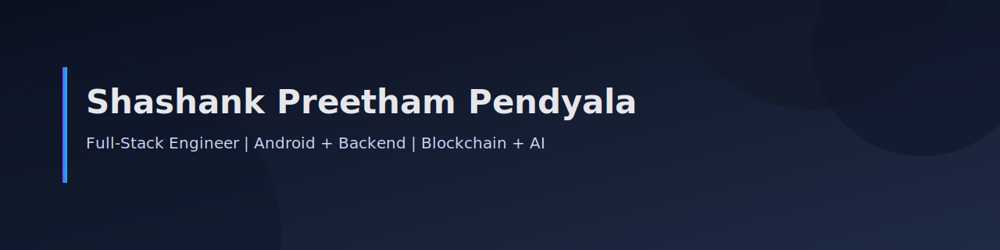



  
  

    
  

# Hi, I'm Shashank Preetham Pendyala

Full-Stack Engineer focused on Android, backend APIs, and production-grade systems. I build end-to-end products with clean architecture and measurable outcomes.

## Highlights

- Android + backend delivery with clean UX and role-based flows
- Blockchain/AI systems for traceability and automation
- Strong system design, reliability, and deployment readiness

## Featured Projects

- **FarmLedger** — Farm-to-shelf traceability (Android + Backend)
  - Android: https://github.com/shashank35i/FarmLedger
  - Backend: https://github.com/shashank35i/FarmLedger-Backend

- **CritiCall** — Multi-role healthcare platform (Android + Backend)
  - Android: https://github.com/shashank35i/criticall
  - Backend: https://github.com/shashank35i/CritiCall-Backend

- **DentraOS** — Agentic AI dental clinic intelligence
  - https://github.com/shashank35i/DentraOS

## What I Can Do

- Build Android apps with role-based UX, QR flows, and offline-tolerant UI
- Design and build REST APIs with secure auth and scalable schemas
- Integrate payments, OTP flows, and notification systems
- Implement blockchain traceability and verification pipelines
- Containerize services and set up Docker-based local stacks

## Tech Stack

Android (Kotlin), PHP, Node.js, MySQL, Hardhat, Python, Docker, Kubernetes

## Contact

- Email: shashankpendyala3549@gmail.com
- LinkedIn: https://www.linkedin.com/in/shashank-preetham-pendyala-711686382/
- Resume: [Resume (PDF)](assets/shashank_resume_associate.pdf)
