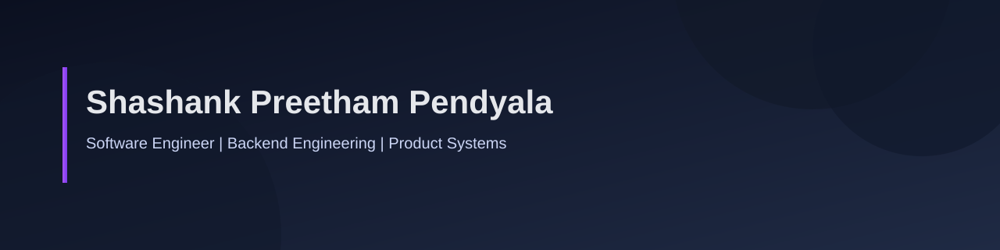

 

 

<h3 align="center">Hi, I'm Shashank Preetham Pendyala</h3>

  Software Engineer • Web + Android • Backend Systems

  I build end-to-end products with clean architecture, reliable APIs, and solid user experiences. 
  From <strong>web platforms</strong> to <strong>Android apps</strong>, I focus on practical, shippable solutions.

 

  

 

  

 

  

 

  
  

 

  

 

  
  &nbsp;&nbsp;
  

 

  

